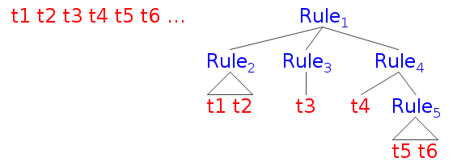

.. Last Modified: 09/09/2014

**********************
Discussion Session 2
**********************

Grammar
=============

* Nonterminal
* Terminal
* Production Rule (Left Hand Side, Right Hand Side)

.. admonition:: Example

  .. productionlist:: grammar1
      start : `exp`            // Start
      exp : `exp` + `term`   // Add
      exp : `exp` - `term`   // Minus
      exp : `term`           // Term
      term : ID              // Id
      term : NUM             // Num
      term : (`exp`)         // Group

Parsing
===============

Parsing is the procedure of transforming a list of tokens into a tree with tokens 
as leaves.

.. note::
  This process is also called derivation.

.. http://ironcreek.net/phpsyntaxtree/

  Token stream ``t1, t2, t3, t4, t5, t6, ......`` and Parsing Tree (Abstract Syntax)

  +-----------------------+-----------------------+
  | Color                 | Meaning               |
  +=======================+=======================+
  | Red                   | Terminal              |
  +-----------------------+-----------------------+
  | Blue                  | Nonterminal           |
  +-----------------------+-----------------------+

.. admonition:: Example

  The abstract syntax for ``1 - 2 - 3 -4`` goes as follows:

  .. [Minus(exp) [Minus(exp) [Minus(exp)  [Term(exp) [Num(term) 1]] - [Num(term) 2]] - [Num(term) 3]] - [Num(term) 4]]
  .. figure:: parsing01.png

* A good grammar has no ambiguity. Only one tree can be constructed from the token stream.

* A good grammar should match human expectation.

  .. admonition:: Example

    Try the following grammar on ``1 - 2 - 3 - 4``.
  
    .. productionlist:: grammar2
        start : `exp`           // Start
        exp : `term` + `exp`    // Add
        exp : `term` - `exp`    // Minus
        exp : `term`            // Term
        term : ID               // Id
        term : NUM              // Num
        term : (`exp`)          // Group

Anatomy of **LL(k)**
=====================
**L**: Left-to-right

  Examine the input (token stream) left-to-right in one parse.

**L**: Leftmost-derivation

  Create / expand the left most sub-tree first.

.. note::
  **R**: Rightmost-derivation
  
  .. admonition:: demo

    Try parsing "1 + 2 - 3 * 4 + 5" with the following grammar.

    .. productionlist:: grammar3
        start : `exp`            // Start
        exp : `exp` + `term`   // Add
        exp : `exp` - `term`   // Minus
        exp : `term`           // Term
        term : `term` * NUM    // Mul
        term : `term` / NUM    // Div
        term : NUM             // Num
        term : (`exp`)         // Group

    .. [Num(term) 1]
    .. figure:: lr_step01.png

      Step 1

    .. [Term(exp) [Num(term) 1]] +
    .. figure:: lr_step02.png

      Step 2

    .. [Term(exp) [Num(term) 1]] + [Num(term) 2]
    .. figure:: lr_step03.png

      Step 3

    .. [Plus(exp) [Term(exp) [Num(term) 1]] + [Num(term) 2]] -
    .. figure:: lr_step04.png

      Step 4

    .. [Plus(exp) [Term(exp) [Num(term) 1]] + [Num(term) 2]] - [Num(term) 3]
    .. figure:: lr_step05.png

      Step 5

    .. [Plus(exp) [Term(exp) [Num(term) 1]] + [Num(term) 2]] - [Num(term) 3] *
    .. figure:: lr_step06.png

      Step 6

    .. [Minus(exp) [Plus(exp) [Term(exp) [Num(term) 1]] + [Num(term) 2]] - [Mul(term) [Num(term) 3] * 4]]
    .. figure:: lr_step07.png

      Step 7

**k**: Lookahead

  Inspect the first **k** tokens before making decision.

Eliminating Left Recursion
=============================

For productions like this:

.. math::
	
	P \rightarrow P\alpha_1 \mid P\alpha_2 \mid \cdots \mid P\alpha_m \mid \beta_1 \mid \cdots \mid \beta_n 

	\textrm{where } \alpha \neq \varepsilon, \beta \textrm{ don't start with } P

It will be turned into

.. math::
	
	P \rightarrow \beta_1 P' \mid \beta_2 P' \mid \cdots \mid \beta_n P'

	P' \rightarrow \alpha_1 P' \mid \alpha_2 P' \mid \cdots \mid \alpha_m P' \mid \varepsilon

And you can verify that the resulting language is the same. 

.. warning:: This is actually eliminating direct left recursions, and turning them into right recursions.
  There are methods to eliminate all recursions, direct or indirect, but it is more complicated, and needs some restrictions on the input grammar.

.. admonition:: Example

  .. productionlist:: grammar4
      start : `exp`            // Start
      exp : `exp` + `term`   // Add
      exp : `exp` - `term`   // Minus
      exp : `term`           // Term
      term : ID              // Id
      term : NUM             // Num
      term : (`exp`)         // Group
  
  is turned into

  .. productionlist:: grammar5
      start : `exp`
      exp : `term` `exp1`
      exp1 : + `term` `exp1`
      exp1 : - `term` `exp1`
      exp1 : epsilon

Coding Demo
==================

Left-factoring
====================

For productions like this:

.. math::
	
	A \rightarrow \delta\beta_1 \mid \delta\beta_2 \mid\cdots\mid\delta\beta_n \mid \gamma_1 \mid \cdots \mid \gamma_m

We turn them into

.. math::

	A \rightarrow \delta A' \mid \gamma_1 \mid \cdots \mid \gamma_m

	A' \rightarrow \beta_1 \mid \cdots \mid \beta_n

.. admonition:: Example

  .. productionlist:: grammar6
      start : `exp`          // Start
      exp : `exp` + `term`   // Add
      exp : `exp` - `term`   // Minus
      exp : `term`           // Term
      term : ID              // Id
      term : NUM             // Num
      term : (`exp`)         // Group
  
  is turned into

  .. productionlist:: grammar7
      start : `exp`
      exp : `exp` `term1`
      term1 : + `term`
      term1 : - `term`
      exp : `term`

  Do left recursion elimination.

  .. productionlist:: grammar8
      start : `exp`
      exp : `term` `exp1`
      exp1 : `term1` `exp1`
      exp1 : epsilon
      term1 : + `term`
      term1 : - `term`

