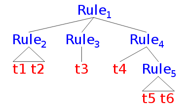

.. Last modified: 09/16/2014

*********************
Discussion Session 3
*********************

Usage of `re.split`
----------------------------

>>> import re
>>> re.split("aa|bb", "aaxxbxb xxxbbxbb") # without outmost parenthesis
['', 'xxbxb xxx', 'x', '']
>>> re.split("(aa|bb)", "aaxxbxb xxxbbxbb") # with outmost parenthesis
['', 'aa', 'xxbxb xxx', 'bb', 'x', 'bb', '']

We can create appropriate regular expression by combining all the *keywords* (not
terminal) of the language.

>>> re.split("(=|\+|\*)", "xa = 1 + 2 * 3") # keywords: =, +, *
['xa ', '=', ' 1 ', '+', ' 2 ', '*', ' 3']

.. warning:: This method cannot be applied to practical languages. Try figuring out
  an example.

.. language containing string

Itch of *escape*
------------------

.. code-block:: python

  >>> re.split("\\", "abc\\er\\")
  Traceback (most recent call last):
    File "/usr/local/lib/python3.4/sre_parse.py", line 194, in __next
      c = self.string[self.index + 1]
  IndexError: string index out of range
  
  During handling of the above exception, another exception occurred:
  
  Traceback (most recent call last):
    File "<stdin>", line 1, in <module>
    File "/usr/local/lib/python3.4/re.py", line 196, in split
      return _compile(pattern, flags).split(string, maxsplit)
    File "/usr/local/lib/python3.4/re.py", line 288, in _compile
      p = sre_compile.compile(pattern, flags)
    File "/usr/local/lib/python3.4/sre_compile.py", line 465, in compile
      p = sre_parse.parse(p, flags)
    File "/usr/local/lib/python3.4/sre_parse.py", line 739, in parse
      source = Tokenizer(str)
    File "/usr/local/lib/python3.4/sre_parse.py", line 182, in __init__
      self.__next()
    File "/usr/local/lib/python3.4/sre_parse.py", line 196, in __next
      raise error("bogus escape (end of line)")
  sre_constants.error: bogus escape (end of line)
  >>> re.split("\\\\", "abc\\er\\")
  ['abc', 'er', '']
  >>> re.split(r"\\", "abc\\er\\") # usage of r"xxxx"
  ['abc', 'er', '']

.. note::
  We have met this problem in assignment1 when our language contains ``+``, 
  ``*``, and etc.

We have to take into consideration two layers of *escape* when using regular
expression related functions of provided by a programming language.

* escape of literal string
* escape of regular expression

Representation of Tree
---------------------------

.. code-block:: python

  tree = {"Rule1", [
                      {"Rule2", [
                                t1, 
                                t2
                                ]}, 
                      {"Rule3", [
                                t3
                                ]},
                      {"Rule4", [
                                t4,
                                {"Rule5", [
                                          t5,
                                          t6
                                          ]}
                                ]}
                    ]}

.. [Rule [Rule t1 t2] [Rule t3] [Rule t4 [Rule t5 t6]]]

.. note::
  Please come up with another represention using only list.

The necessity of *backtracking*
-----------------------------------

.. admonition:: Discussion

  Why do we want to use backtracking?

  .. lookahead contant number of tokens

Logging in Python
-----------------------------------

.. admonition:: Discussion

  What's the problem of ``print``?

Logging is a systematic approach to recording trace of the execution of a program.

.. multiple level of message
.. multiple target
.. filter, handler
.. configurable

:download:`demo_logging.py <demo_logging.py>`

.. literalinclude:: demo_logging.py
 :language: python
 :linenos:

Output is::

  INFO:__main__:Start reading database
  DEBUG:__main__:Records: {'john': 55, 'tom': 66}
  INFO:__main__:Updating records ...
  INFO:__main__:Finish updating records

An easy-to-read blog about logging module in Python: http://victorlin.me/posts/2012/08/26/good-logging-practice-in-python

.. admonition:: Discussion

  Where to put logging statement?

Semantics revisted
---------------------------------

Let's go over the rules for execution in the 
`note <http://cs-people.bu.edu/lapets/320/s.php?#cbfa02d3624d42b08704d6a4c4fb9e03>`_.

.. note::
  The right hand side of symbol :math:`\Downarrow` is the result of execution. It
  can be value resulting from expression, or it can be effect resulting from
  statement.

.. admonition:: Example

  Try executing ``print true; assign x = true; assign y = x or false; print y; end;``
  manually based on those rules.

Assignment 1 revisted
------------------------------

